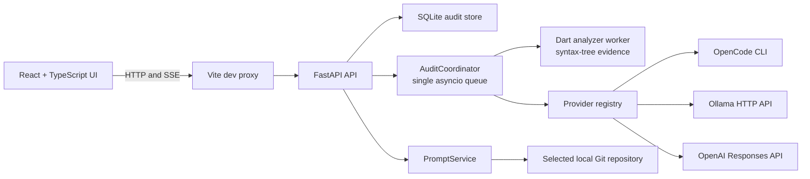

<p align="center">
  
</p>

<h1 align="center">Perfora</h1>

<p align="center">
  Evidence-first AI performance and security engineering for Flutter applications.
</p>

Perfora is a local-first web workspace that inspects a Flutter repository with a
deterministic Dart analyzer, enriches confirmed findings with a model selected
by the user, and can copy a complete finding prompt for handoff to another AI
agent.

The current `0.1.0` tracer supports OpenCode, Ollama, and OpenAI without silently
switching providers or models.

## What works today

- Local Flutter project selection through a native macOS folder picker or an
  absolute path.
- Browser-persisted project history and an explicit project picker for each
  audit.
- Dynamic model discovery from OpenCode, Ollama, and OpenAI.
- Explicit provider and model selection; every audit stores the selected model
  identifier and its discovered metadata.
- Static lifecycle-resource checks for Riverpod, Provider, Bloc/Cubit, GetX,
  and general Flutter classes.
- Static security checks for hardcoded credentials, cleartext endpoints, disabled
  TLS validation, Android cleartext traffic, and global iOS transport exceptions.
- Evidence, severity, confidence, source location, recommendation, and model
  explanation views.
- Server-sent audit progress events and durable audit history in SQLite.
- Secret-redacted agent handoff prompts containing audit provenance, repository
  state, all finding details, recommendations, context manifest, and current source.
- JSON, HTML, and SARIF audit exports.

## Quick start

### Requirements

- macOS for the native folder picker. Manual absolute paths remain available.
- Git.
- Node.js 22 or newer.
- Python 3.12 or newer.
- Flutter with Dart 3.5 or newer.
- At least one configured model provider:
  - OpenCode CLI,
  - a running Ollama server with a generation model, or
  - an OpenAI project API key.

### 1. Clone and install

```bash
git clone https://github.com/Eslam-Emad/Perfora.git
cd Perfora

npm install

python3 -m venv .venv
.venv/bin/pip install -e "apps/api[dev]"

(cd tools/analyzer && dart pub get)
```

### 2. Create the local configuration

```bash
cp .env.example .env.local
```

The default configuration works with Ollama at
`http://127.0.0.1:11434`. To enable OpenAI, set `OPENAI_API_KEY` in
`.env.local`. Leave it empty when using only OpenCode or Ollama.

`.env.local` is Git-ignored. Do not commit API keys.

### 3. Start Perfora

Run the API in the first terminal:

```bash
npm run dev:api
```

Run the web app in a second terminal:

```bash
npm run dev:web
```

Open [http://127.0.0.1:5173](http://127.0.0.1:5173).

To confirm the API is ready:

```bash
curl http://127.0.0.1:8765/api/health
```

Expected response:

```json
{"name":"Perfora","status":"ready","version":"0.1.0"}
```

Use `Ctrl+C` in both terminals to stop the app.

### 4. Run the first audit

1. Open **Setup** and confirm Git, Dart, Flutter, and at least one provider are
   ready.
2. Open **Repositories**.
3. Select **Browse…** to use the native macOS folder picker, or enter an
   absolute Flutter project path and select **Add path**.
4. Select **New audit**.
5. Confirm the project and choose the lifecycle-performance or application-security
   audit flow.
6. Select a provider, filter its discovered models, and choose the exact model to use.
7. Approve source evidence transmission when the selected model is remote or
   its routing locality is unknown.
8. Start the audit and inspect the streamed evidence and recommendations.

## Model providers

| Provider | Discovery | Generation | Locality |
| --- | --- | --- | --- |
| OpenCode | `opencode models` | `opencode run --model … --format json --pure` | Determined by OpenCode, so Perfora treats it as unknown |
| Ollama | `GET /api/tags` | `POST /api/generate` with a JSON schema | Local, except model names containing `:cloud` |
| OpenAI | `GET /v1/models` | `POST /v1/responses` with strict structured output and `store: false` | Remote |

Unavailable providers remain visible in **Setup** and **Settings** with their
observed connection status. Perfora rejects an audit when its selected provider
or model is no longer available.

## How an audit works

1. FastAPI validates the selected directory, finds Flutter `pubspec.yaml`
   files, and records the Git branch, commit, worktree state, package list, and
   a source fingerprint.
2. `AuditCoordinator` saves a queued audit and sends its identifier to one
   in-process `asyncio.Queue` worker.
3. `DartAnalyzerClient` starts the selected analyzer worker with
   `dart run bin/perfora_analyzer.dart --root <repository> --audit-type <type>`.
4. The Dart worker either finds owned lifecycle resources without matching cleanup,
   or inspects security-sensitive Dart code and Android/iOS transport policy.
5. Confirmed findings are persisted before model generation begins.
6. The selected provider enriches the first finding with a structured
   explanation and recommendation. Provider failure leaves a durable partial
   audit instead of discarding deterministic evidence.
7. The browser receives progress through
   `GET /api/audits/{audit_id}/events` using server-sent events.

### Lifecycle rule pack

| Resource family | Required cleanup |
| --- | --- |
| Controllers, notifiers, focus nodes, and GetX workers | `dispose()` |
| `StreamSubscription` and `Timer` | `cancel()` |
| `StreamController` | `close()` |

### Security rule pack

| Rule | Confirmed evidence |
| --- | --- |
| Hardcoded credential | A sensitive identifier is assigned a non-placeholder string literal; the value is never included in evidence |
| Cleartext endpoint | A non-loopback `http://` URL is embedded in Dart source |
| Disabled TLS validation | `badCertificateCallback` unconditionally accepts certificates |
| Android cleartext traffic | `AndroidManifest.xml` explicitly enables `usesCleartextTraffic` |
| iOS arbitrary loads | `Info.plist` globally enables `NSAllowsArbitraryLoads` |

Every finding includes a deterministic explanation and a specific recommendation.
The selected model may enrich the first finding without replacing the observed evidence.

The analyzer recognizes framework ownership through class inheritance and
lifecycle hooks. Files ending in `.g.dart`, `.freezed.dart`, `.gr.dart`, or
`.config.dart`, plus `.dart_tool`, `build`, `.git`, and `node_modules`, are
excluded.

## Agent handoff prompt

Select **Copy prompt** on a finding to copy a complete implementation brief for
another AI agent. Perfora assembles it locally and does not contact a model. The
prompt includes the recorded audit and repository provenance, every finding
field, deterministic evidence and explanation, model explanation when present,
recommendation, context manifest, and the complete current finding source.
Likely secrets are replaced with `[REDACTED]` before the prompt reaches the
browser. The receiving agent is instructed to confirm the root cause, preserve
unrelated changes, avoid broad security bypasses, run focused validation, and
report its changes and remaining risk.

## Architecture



## Implementation details

| Area | Implementation | Responsibility |
| --- | --- | --- |
| Web app | React, TypeScript, Vite, Vitest | Setup, saved project picker, model picker, audit workspace, prompt copying, and exports |
| API | Python, FastAPI, Pydantic, HTTPX | Routes, provider catalogs, audit orchestration, SSE, exports, and handoff prompt assembly |
| Analyzer | Dart analyzer package | AST parsing, framework classification, resource ownership, cleanup detection, and JSON findings |
| Persistence | Python `sqlite3` | Stores each complete `AuditRecord` as JSON in the `audits` table |
| Providers | Adapter registry | Normalizes model discovery and schema-constrained generation across three provider types |
| Local process runner | Python `asyncio` subprocesses | Runs Git, Dart, OpenCode, and the macOS folder picker with bounded timeouts |

The React app stores validated project snapshots in browser `localStorage`.
Audit records and events are stored in `perfora.db` by default.

## Configuration

The API loads `.env.local` from the repository root.

| Variable | Default | Purpose |
| --- | --- | --- |
| `OPENAI_API_KEY` | empty | Enables OpenAI model discovery and generation |
| `OPENAI_BASE_URL` | `https://api.openai.com/v1` | OpenAI-compatible API base URL |
| `PERFORA_OLLAMA_BASE_URL` | `http://127.0.0.1:11434` | Ollama API base URL |
| `PERFORA_DATABASE_PATH` | `./perfora.db` | SQLite audit database path |

The web server binds to `127.0.0.1:5173`; the API binds to
`127.0.0.1:8765`. These values currently come from the checked-in npm scripts,
not environment variables.

## Repository layout

```text
apps/web/        React application and browser tests
apps/api/        FastAPI application and API tests
tools/analyzer/  Dart analyzer worker, fixtures, and tests
docs/            Product and architecture decisions
```

## Development checks

Run the checks used for the current implementation:

```bash
npm run build:web
npm run test:web

.venv/bin/ruff check apps/api
.venv/bin/pytest apps/api/tests -q

(cd tools/analyzer && dart format --output=none --set-exit-if-changed .)
(cd tools/analyzer && dart analyze)
(cd tools/analyzer && dart test)
```

`npm test` runs the web and API test suites. Dart analyzer tests remain a
separate command.

## Troubleshooting

### The analyzer is unavailable

Confirm `dart` is on `PATH`, then install the worker dependencies:

```bash
(cd tools/analyzer && dart pub get)
```

### No compatible models are listed

- OpenCode: confirm `opencode models` returns configured models.
- Ollama: confirm `curl http://127.0.0.1:11434/api/tags` succeeds and at least
  one non-embedding model is installed.
- OpenAI: confirm `OPENAI_API_KEY` is present in `.env.local`, then restart the
  API.

Use **Refresh health** or **Test connections** after correcting a provider.

### Copy prompt fails

Confirm that the finding's source file still exists under the recorded
repository path and is readable. Perfora refuses paths outside that repository
and source files larger than 1,000,000 characters. Browser clipboard permission
must also be available.

## Current limitations

- Static source analysis only; there is no runtime frame, memory, startup,
  network, or bundle profiler yet.
- Only the first deterministic finding receives model enrichment in the current
  tracer.
- The audit queue is in-process and handles one audit at a time.
- Native folder browsing is macOS-only; manual absolute paths are available on
  other platforms but are not certified.
- Model capability filtering is heuristic.
- Single local user; no authentication, collaboration, hosted deployment, or
  automatic telemetry.
