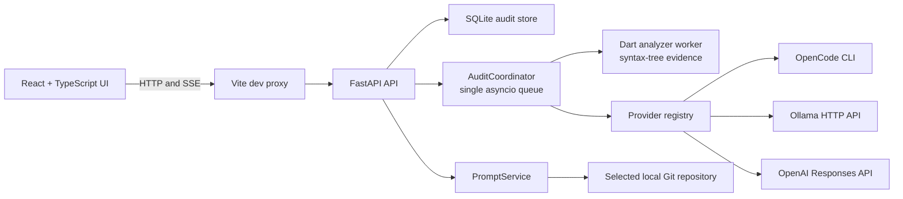

<p align="center">
  
</p>

<h1 align="center">Perfora</h1>

<p align="center">
  Evidence-first AI performance and security engineering for Flutter applications.
</p>

Perfora is a local-first web workspace that inspects a Flutter repository with a
deterministic Dart analyzer, enriches confirmed findings with a model selected
by the user, and can copy a complete finding prompt for handoff to another AI
agent.

The current `0.2.0` release supports deterministic CLI/CI audits plus OpenCode,
Ollama, and OpenAI workspace enrichment without silently
switching providers or models.

## What works today

- Local Flutter project selection through a native macOS folder picker or an
  absolute path.
- Browser-persisted project history and an explicit project picker for each
  audit.
- Dynamic model discovery from OpenCode, Ollama, and OpenAI.
- Explicit provider and model selection; every audit stores the selected model
  identifier and its discovered metadata.
- Static lifecycle-resource checks for Riverpod, Provider, Bloc/Cubit, GetX,
  and general Flutter classes.
- Static security checks for hardcoded credentials, cleartext endpoints, disabled
  TLS validation, Android cleartext traffic, and global iOS transport exceptions.
- Evidence, severity, confidence, source location, recommendation, and model
  explanation views.
- Stable finding fingerprints, versioned analyzer/rule-pack provenance, and
  structured counts for scanned and skipped files.
- Persistent finding triage with owner, due date, append-only notes, external
  ticket, resolution reference, disposition reason, suppression expiration,
  and status history.
- Automatic comparison with the previous compatible audit, plus selectable
  baselines and classifications for new, unchanged, resolved, regressed, and
  severity-changed findings.
- Search and filters for severity, triage state, and baseline classification.
- Deterministic finding verification that re-runs the original rule pack,
  requires per-file scan proof, persists every attempt, and either certifies
  resolution, reopens a reproduced finding, or reports an inconclusive result.
- Deterministic explanations and recommendations remain distinct from optional
  model enrichment.
- Server-sent audit progress events and durable audit history in SQLite.
- Secret-redacted agent handoff prompts containing audit provenance, repository
  state, all finding details, recommendations, context manifest, and current source.
- JSON, HTML, and SARIF audit exports.
- A non-interactive `perfora audit` command with repository policy, include/exclude
  globs, timeouts, Git baselines, new-only gates, stable exit codes, and provider-free
  JSON, HTML, SARIF, and Markdown CI artifacts.

## Quick start

### Requirements

- macOS for the native folder picker. Manual absolute paths remain available.
- Git.
- Node.js 22 or newer.
- Python 3.12 or newer.
- Flutter with Dart 3.5 or newer.
- At least one configured model provider:
  - OpenCode CLI,
  - a running Ollama server with a generation model, or
  - an OpenAI project API key.

### 1. Clone and install

```bash
git clone https://github.com/Eslam-Emad/Perfora.git
cd Perfora

npm install

python3 -m venv .venv
.venv/bin/pip install -e "apps/api[dev]"

(cd tools/analyzer && dart pub get)
```

### 2. Create the local configuration

```bash
cp .env.example .env.local
```

The default configuration works with Ollama at
`http://127.0.0.1:11434`. To enable OpenAI, set `OPENAI_API_KEY` in
`.env.local`. Leave it empty when using only OpenCode or Ollama.

`.env.local` is Git-ignored. Do not commit API keys.

### 3. Start Perfora

Run the API in the first terminal:

```bash
npm run dev:api
```

Run the web app in a second terminal:

```bash
npm run dev:web
```

Open [http://127.0.0.1:5173](http://127.0.0.1:5173).

To confirm the API is ready:

```bash
curl http://127.0.0.1:8765/api/health
```

Expected response:

```json
{"name":"Perfora","status":"ready","version":"0.2.0"}
```

Use `Ctrl+C` in both terminals to stop the app.

### Run a provider-free CI audit

The CLI is installed with the API package and never invokes a model provider:

```bash
perfora audit \
  --repository . \
  --type security \
  --baseline origin/main \
  --format sarif \
  --output artifacts/perfora.sarif \
  --summary artifacts/perfora-summary.md \
  --fail-on new-high \
  --deterministic-only
```

Copy `.perfora.example.yaml` to `.perfora.yaml` to share rule-pack selection,
path filters, severity gates, and governed suppressions with the repository.
See [CLI and CI adoption](docs/ci-adoption.md) for exit codes, baseline behavior,
monorepo selection, and GitHub/GitLab templates.

### 4. Run the first audit

1. Open **Setup** and confirm Git, Dart, Flutter, and at least one provider are
   ready.
2. Open **Repositories**.
3. Select **Browse…** to use the native macOS folder picker, or enter an
   absolute Flutter project path and select **Add path**.
4. Select **New audit**.
5. Confirm the project and choose the lifecycle-performance or application-security
   audit flow.
6. Select a provider, filter its discovered models, and choose the exact model to use.
7. Approve source evidence transmission when the selected model is remote or
   its routing locality is unknown.
8. Start the audit and inspect the streamed evidence and recommendations.
9. Compare the result with a prior audit, filter the evidence queue, and record
   ownership or a triage decision on each finding.

## Model providers

| Provider | Discovery | Generation | Locality |
| --- | --- | --- | --- |
| OpenCode | `opencode models` | `opencode run --model … --format json --pure` | Determined by OpenCode, so Perfora treats it as unknown |
| Ollama | `GET /api/tags` | `POST /api/generate` with a JSON schema | Local, except model names containing `:cloud` |
| OpenAI | `GET /v1/models` | `POST /v1/responses` with strict structured output and `store: false` | Remote |

Unavailable providers remain visible in **Setup** and **Settings** with their
observed connection status. Perfora rejects an audit when its selected provider
or model is no longer available.

## How an audit works

1. FastAPI validates the selected directory, finds Flutter `pubspec.yaml`
   files, and records the Git branch, commit, worktree state, package list, and
   a source fingerprint.
2. `AuditCoordinator` saves a queued audit and sends its identifier to one
   in-process `asyncio.Queue` worker.
3. `DartAnalyzerClient` starts the selected analyzer worker with
   `dart run bin/perfora_analyzer.dart --root <repository> --audit-type <type>`.
4. The Dart worker returns versioned findings and structured scan coverage,
   including why generated, vendor, binary, or unsupported files were skipped.
5. Confirmed findings receive stable semantic fingerprints and are persisted
   before model generation begins.
6. Perfora selects the newest completed or partial audit for the same repository
   path and audit type, carries active triage metadata by fingerprint, and marks
   finding changes. Resolved findings that reappear are reopened as regressions.
7. The selected provider enriches the first finding with a structured
   explanation and recommendation stored separately from deterministic content.
   Provider failure leaves a durable partial audit instead of discarding evidence.
8. The browser receives progress through
   `GET /api/audits/{audit_id}/events` using server-sent events.

## Finding lifecycle and baselines

Findings can be moved through `new`, `investigating`, `in progress`, `resolved`,
`false positive`, `risk accepted`, and `reopened`. False-positive and
risk-accepted decisions require a recorded reason; optional suppressions must
expire in the future. `Verified resolved` is deliberately not a manual choice:
it is reserved for a deterministic re-scan in the verification phase.

### Deterministic verification

After implementing a change, mark the finding `resolved` and select
**Verify resolution**. Perfora inspects the current repository and runs the same
audit-type rule pack without contacting a model. A finding becomes
`verified resolved` only when:

- its original rule executed;
- the original source file was included in the per-file scan manifest, or the
  file no longer exists; and
- neither the stable fingerprint nor the same rule/file/symbol identity is
  observed again.

If the source is skipped, the rule does not execute, or an older analyzer does
not provide per-file coverage, verification is `inconclusive` and triage is not
changed. If the finding reproduces, it becomes `reopened`. Each attempt records
the current Git snapshot, analyzer and rule-pack versions, coverage, outcome,
message, and current evidence.

The default baseline is the newest older completed or partial audit with the
same exact repository path and audit type. A different eligible baseline can be
selected in the workspace. Fingerprints—not mutable line numbers—drive the
comparison. Triage metadata follows unchanged findings; a previously resolved
or expired suppressed finding is reopened when it appears again.

### Lifecycle rule pack

| Resource family | Required cleanup |
| --- | --- |
| Controllers, notifiers, focus nodes, and GetX workers | `dispose()` |
| `StreamSubscription` and `Timer` | `cancel()` |
| `StreamController` | `close()` |

### Security rule pack

| Rule | Confirmed evidence |
| --- | --- |
| Hardcoded credential | A sensitive identifier is assigned a non-placeholder string literal; the value is never included in evidence |
| Cleartext endpoint | A non-loopback `http://` URL is embedded in Dart source |
| Disabled TLS validation | `badCertificateCallback` unconditionally accepts certificates |
| Android cleartext traffic | `AndroidManifest.xml` explicitly enables `usesCleartextTraffic` |
| iOS arbitrary loads | `Info.plist` globally enables `NSAllowsArbitraryLoads` |

Every finding includes a deterministic explanation and a specific recommendation.
The selected model may enrich the first finding without replacing the observed evidence.

The analyzer recognizes framework ownership through class inheritance and
lifecycle hooks. Files ending in `.g.dart`, `.freezed.dart`, `.gr.dart`, or
`.config.dart`, plus `.dart_tool`, `build`, `.git`, and `node_modules`, are
excluded.

See [the support and coverage matrix](./docs/support-matrix.md) for exact file,
platform, exclusion, and compatibility boundaries.

## Agent handoff prompt

Select **Copy prompt** on a finding to copy a complete implementation brief for
another AI agent. Perfora assembles it locally and does not contact a model. The
prompt includes the recorded audit and repository provenance, every finding
field, lifecycle status, owner, disposition, notes and history, deterministic
evidence and recommendation, separately labeled model
enrichment when present, context manifest, and the complete current finding source.
Likely secrets are replaced with `[REDACTED]` before the prompt reaches the
browser. The receiving agent is instructed to confirm the root cause, preserve
unrelated changes, avoid broad security bypasses, run focused validation, and
report its changes and remaining risk.

## Architecture



## Implementation details

| Area | Implementation | Responsibility |
| --- | --- | --- |
| Web app | React, TypeScript, Vite, Vitest | Setup, saved project picker, model picker, comparison and triage workspace, prompt copying, and exports |
| API | Python, FastAPI, Pydantic, HTTPX | Routes, provider catalogs, audit orchestration, stable finding identity, lifecycle, baselines, SSE, exports, and handoff prompt assembly |
| Analyzer | Dart analyzer package | Versioned AST rule packs, framework classification, evidence, and per-file structured scan coverage for verification |
| Persistence | Python `sqlite3` | Applies ordered schema migrations and stores versioned `AuditRecord` JSON |
| Providers | Adapter registry | Normalizes model discovery and schema-constrained generation across three provider types |
| Local process runner | Python `asyncio` subprocesses | Runs Git, Dart, OpenCode, and the macOS folder picker with bounded timeouts |

The React app stores validated project snapshots in browser `localStorage`.
Audit records and events are stored in `perfora.db` by default.

## Configuration

The API loads `.env.local` from the repository root.

| Variable | Default | Purpose |
| --- | --- | --- |
| `OPENAI_API_KEY` | empty | Enables OpenAI model discovery and generation |
| `OPENAI_BASE_URL` | `https://api.openai.com/v1` | OpenAI-compatible API base URL |
| `PERFORA_OLLAMA_BASE_URL` | `http://127.0.0.1:11434` | Ollama API base URL |
| `PERFORA_DATABASE_PATH` | `./perfora.db` | SQLite audit database path |

The web server binds to `127.0.0.1:5173`; the API binds to
`127.0.0.1:8765`. These values currently come from the checked-in npm scripts,
not environment variables.

## Repository layout

```text
apps/web/        React application and browser tests
apps/api/        FastAPI application and API tests
tools/analyzer/  Dart analyzer worker, fixtures, and tests
docs/            Product and architecture decisions
```

## Development checks

Run the checks used for the current implementation:

```bash
npm run build:web
npm run test:web

.venv/bin/ruff check apps/api
.venv/bin/pytest apps/api/tests -q

(cd tools/analyzer && dart format --output=none --set-exit-if-changed .)
(cd tools/analyzer && dart analyze)
(cd tools/analyzer && dart test)
```

`npm test` runs the web and API test suites. Dart analyzer tests remain a
separate command.

## Troubleshooting

### The analyzer is unavailable

Confirm `dart` is on `PATH`, then install the worker dependencies:

```bash
(cd tools/analyzer && dart pub get)
```

### No compatible models are listed

- OpenCode: confirm `opencode models` returns configured models.
- Ollama: confirm `curl http://127.0.0.1:11434/api/tags` succeeds and at least
  one non-embedding model is installed.
- OpenAI: confirm `OPENAI_API_KEY` is present in `.env.local`, then restart the
  API.

Use **Refresh health** or **Test connections** after correcting a provider.

### Copy prompt fails

Confirm that the finding's source file still exists under the recorded
repository path and is readable. Perfora refuses paths outside that repository
and source files larger than 1,000,000 characters. Browser clipboard permission
must also be available.

## Current limitations

- Static source analysis only; there is no runtime frame, memory, startup,
  network, or bundle profiler yet.
- Only the first deterministic finding receives model enrichment in the current
  tracer.
- The audit queue is in-process and handles one audit at a time.
- Native folder browsing is macOS-only; manual absolute paths are available on
  other platforms but are not certified.
- Model capability filtering is heuristic.
- Single local user; no authentication, collaboration, hosted deployment, or
  automatic telemetry.
